# Getting Started with RamaLama — Outreachy 2026 Task

## What is RamaLama?

Before RamaLama, running an AI model locally meant hours of setup   drivers, environments, configs. RamaLama changes that completely. It wraps everything into containers so you can focus on using the model, not setting it up.

For my Outreachy project, I'll be using RamaLama to enhance language models using RAG (Retrieval Augmented Generation) to improve software packaging quality within the Fedora Project. This task was my first hands-on experience with the tool.

---

## My Setup

- **OS:** macOS (Apple Silicon — M2, arm64)
- **RamaLama version:** 0.18.0
- **Container engine:** Docker Desktop
- **Installation method:** Homebrew

> I used macOS instead of Fedora since that's my available system. 
---

## Step 1 — Installation

Since I'm on macOS, I installed RamaLama using Homebrew:

```bash
brew install ramalama
```

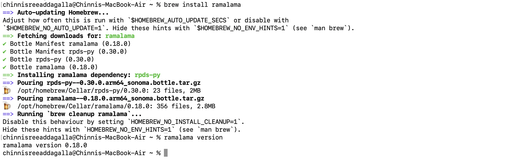

---

## Step 2 — Checking the Version

```bash
ramalama version
```

**Output:**
```
ramalama version 0.18.0
```

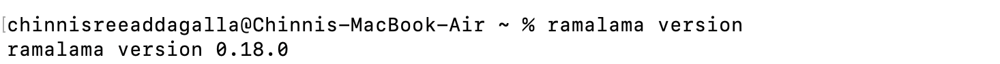

---

## Step 3 — Pulling My First Model (ollama transport)

I chose **tinyllama** as my first model. It's small (~608MB), fast to download and a good starting point for testing. I used the `ollama://` transport, which is RamaLama's default and pulls from the Ollama registry.

```bash
ramalama pull ollama://tinyllama
```

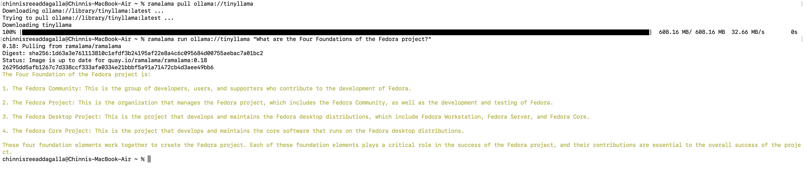

---

## Step 4 — Running the Model

```bash
ramalama run ollama://tinyllama "What are the Four Foundations of the Fedora project?"
```

**What tinyllama said:**
> The Four Foundations are: The Fedora Community, The Fedora Project, The Fedora Desktop Project, and The Fedora Core Project.

**The correct answer:**
 The Four Foundations of Fedora are **Freedom, Friends, Features, and First.** But tinyllama got it completely wrong.


I tried another question with the following prompt :
```bash
ramalama run ollama://tinyllama "What is the difference between Fedora Workstation, Fedora Server and Fedora Spins?"
```
**What tinyllama said:**
>Fedora Workstation is a lightweight version designed for embedded systems. Fedora Server powers web servers like Apache and Nginx. Fedora Spins are customized versions for industries like education and government.

**The correct answer:** The answer is partially correct
- Fedora Workstation -> For developers and desktop users, comes with GNOME desktop but not embedded systems
- Fedora Server -> For servers and data centers no GUI : this part was mostly correct
- Fedora Spins -> Alternative desktop environments like KDE, XFCE, Cinnamon but not industry-specific distributions

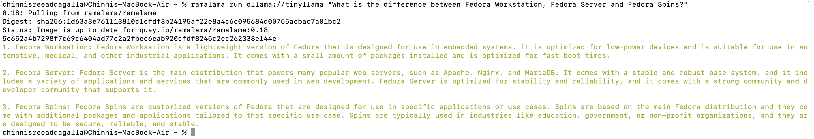
---

## Step 5 — Second Model with a Different Transport (HuggingFace)

For the second model, I used the `huggingface://` transport to pull TinyLlama from HuggingFace a completely different source from the Ollama registry.

```bash
ramalama pull huggingface://TheBloke/TinyLlama-1.1B-Chat-v1.0-GGUF
```

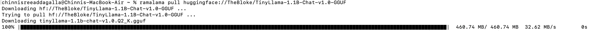

Then I ran the same prompt to compare:

```bash
ramalama run huggingface://TheBloke/TinyLlama-1.1B-Chat-v1.0-GGUF "What are the Four Foundations of the Fedora project?"
```

**What HuggingFace TinyLlama said:**
> The Four Foundations are: Core Contributions, Backporting, Enhancements and Maintenance.

Again, wrong. Different model source, same problem.

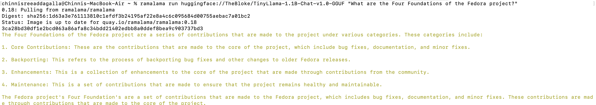

I tried another question with the following prompt :

```bash
ramalama run huggingface://TheBloke/TinyLlama-1.1B-Chat-v1.0-GGUF "What is the difference between Fedora Workstation, Fedora Server and Fedora Spins?"
```
**What HuggingFace TinyLlama said:**
>Fedora Works and Fedora Server use the same kernel source code with different configurations. Fedora Spins use a different kernel configuration for customized builds. Overall they are different KDE distributions.

Again this gave the wrong answer 

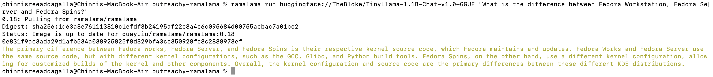
---

## Extra Commands I Explored

### Listing all pulled models

```bash
ramalama list
```

```
NAME                                          MODIFIED       SIZE
ollama://library/tinyllama:latest             15 hours ago   608.16 MB
hf://TheBloke/TinyLlama-1.1B-Chat-v1.0-GGUF  14 hours ago   460.74 MB
```

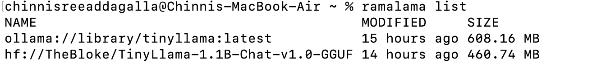

### Checking system info

```bash
ramalama info
```

This showed my system details : architecture (aarch64), container engine (Docker), accelerator (none — CPU only) and RamaLama version.

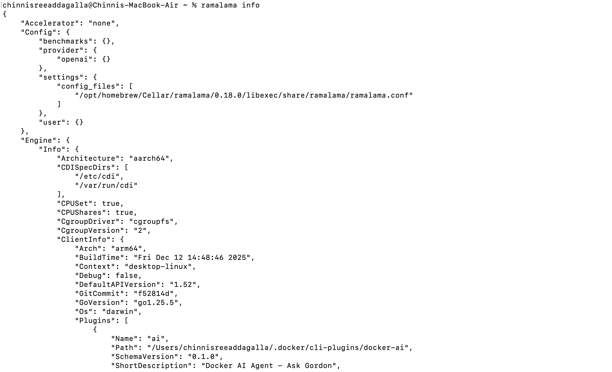

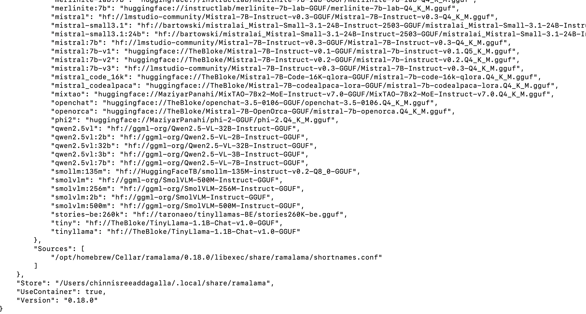

---

## Comparing the Two Models

| | Model 1 | Model 2 |
|---|---|---|
| **Name** | tinyllama | TinyLlama-1.1B-Chat-v1.0-GGUF |
| **Transport** | `ollama://` | `huggingface://` |
| **Size** | 608.16 MB | 460.74 MB |
| **Four Foundations answer** |  Wrong |  Wrong |
| **Workstation vs Server vs Spins** | Partially Correct | Wrong |

Both models ran successfully and generated responses without any errors. However, while the output was generated smoothly, the accuracy of Fedora-specific answers was poor in both cases.

### What I tried but couldn't complete

I also attempted to use the **OCI transport** (`oci://`) with Mistral:

```bash
ramalama pull oci://quay.io/ramalama/mistral:latest
# Error: quay.io/ramalama/mistral:latest does not exist.
```

After research, I found that the correct OCI model registry is `rlcr.io/ramalama/` not `quay.io/ramalama/`. I skipped downloading due to storage constraints on my Mac (disk was 99% full) but documented the error and correct path for future reference.

---

## Does RamaLama Make AI Boring? My Opinion

Honestly, yes and that's the whole point. I expected the usual setup struggle but instead I typed one command and had a model running in minutes. No CUDA, no dependency issues, nothing to configure. It just worked.

But here's the thing boring setup doesn't mean boring results. Watching tinyllama give completely wrong answers about Fedora was actually the most interesting part. It made me realize why this Outreachy project exists in the first place. 

RamaLama makes running models easy. RAG makes them accurate. You need both.

---

## Errors & Issues I Encountered
 
Here are the issues I ran into and how I dealt with them:
 
**1. phi3 timeout error**
 
My first attempt was with phi3 but it kept timing out after 180 seconds. The container would start but never pass the health check.
 
```
ERROR - Failed to serve model phi3, for ramalama run command
ERROR - Command 'health check of container' timed out after 180 seconds
```
 
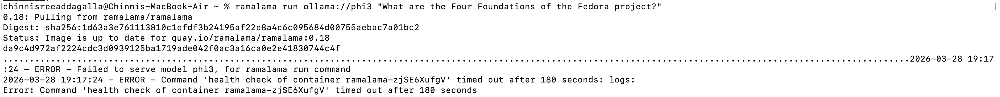
 
I switched to tinyllama which is lighter and worked fine.
 
**2. OCI transport path was wrong**
 
When I tried the OCI transport with Mistral, the registry path didn't exist. After research I found the correct path but skipped it due to storage constraints.
 
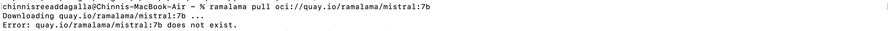
 
**3. Storage issues**
 
My Mac ran out of storage multiple times. phi3 alone was 2GB and combined with Docker images it filled up quickly. I had to regularly run `docker system prune` to free space.
 
---
## Key Takeaway

Small models are great at general knowledge but struggle with project-specific details. RamaLama + RAG is the solution by feeding accurate Fedora documentation directly to the model, we can dramatically improve the quality and consistency of AI-generated packaging information.

---
## References

- [RamaLama Documentation](https://ramalama.ai/docs/introduction/)
- [Fedora Project — Four Foundations](https://docs.fedoraproject.org/en-US/project/)
- [HuggingFace Documentation](https://huggingface.co/docs)
- [How RamaLama makes working with AI models boring — Red Hat Developer](https://developers.redhat.com/articles/2024/11/22/how-ramalama-makes-working-ai-models-boring#)


